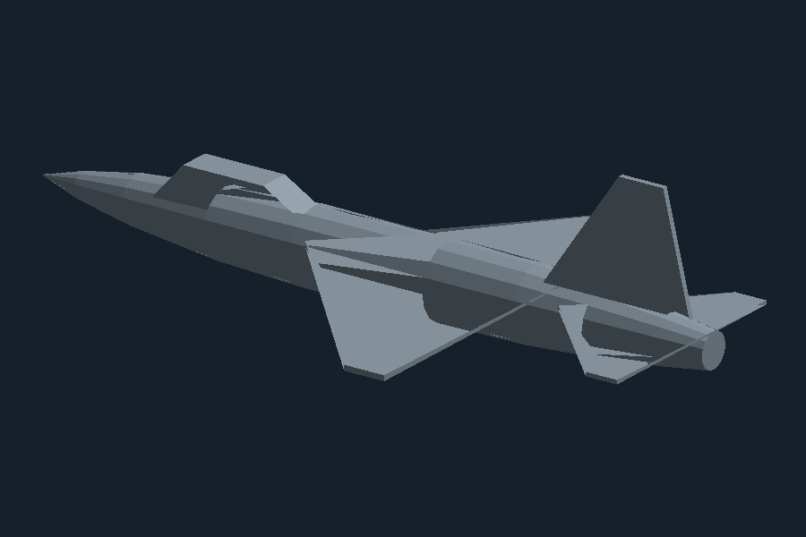

# Military Jet for SolidWorks

A parametric single-seat fighter jet (F-16 style, ~15 m long, 9.2 m wingspan).



SolidWorks only runs on Windows, so the model is delivered in two ways —
pick whichever fits your workflow:

## Option 1 — Build it natively in SolidWorks (recommended)

`MilitaryJet.bas` is a VBA macro that models the jet feature by feature
(revolved fuselage, mid-plane extruded delta wings, stabilizers, tail fin,
and canopy), leaving you a fully editable feature tree.

1. Open SolidWorks (2018+, English UI).
2. **Tools > Macro > New...**, save as `MilitaryJet.swp`.
3. In the VBA editor, **File > Import File...** and pick `MilitaryJet.bas`
   (or paste its contents into the module).
4. Press **F5**. A new part is created and the jet is built.

All dimensions are constants at the top of the macro (in metres) — change
`WING_SPAN`, `FUSELAGE_LENGTH`, etc. and re-run to reshape the aircraft.
After it builds, add fillets on the canopy/wing edges and appearances to
taste.

> Non-English SolidWorks: the macro selects "Front Plane" / "Top Plane" by
> name — edit those strings in `SelectPlane` calls to match your UI language.

## Option 2 — Import the ready-made STL

`military_jet.stl` is the same geometry as a watertight mesh (376 triangles,
millimetre units).

1. In SolidWorks: **File > Open**, file type *STL*.
2. Under **Options**, choose *Solid Body* (or *Graphics Body* for a lighter
   import), units **mm**.

The STL also opens in any other CAD/slicer/viewer (Fusion, FreeCAD, Cura...).

## Regenerating the STL

`generate_jet_stl.py` builds the mesh from scratch with no dependencies:

```bash
python3 generate_jet_stl.py   # writes military_jet.stl
```

Tweak the station table (fuselage cross-sections) or the wing/tail polygons
in the script to change the design.

## Dimensions

| Item                 | Value  |
| -------------------- | ------ |
| Length               | 15.0 m |
| Wingspan             | 9.2 m  |
| Max fuselage radius  | 0.8 m  |
| Tail fin height      | 3.0 m  |
| Stabilizer span      | 4.8 m  |
